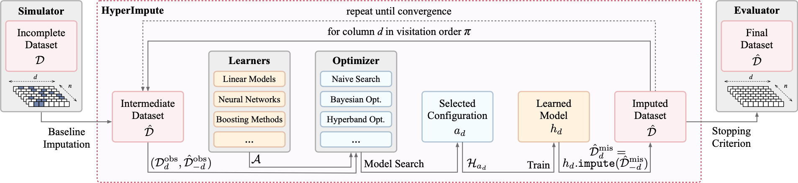
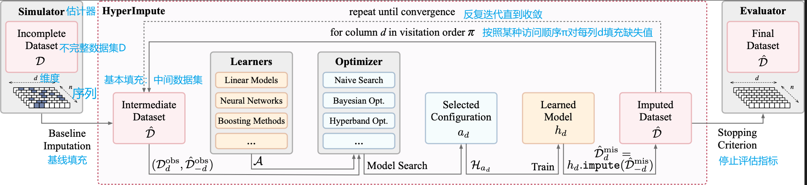

# 插补框架

对插补方法进行原型设计和基准测试的框架：用于Nan和null的库

原版:

理解版本：

文字理解：

数据处理中缺失值填充（imputation）的流程图或算法框架。可视化算法或流程。

1. **模拟器（Simulator）**：初始阶段，给定一个不完整的数据集 \( D \)。不完整的特点通常通过一些单元格为空或有不同阴影来可视化表示。

2. **基线填充（Baseline Imputation）**：初始阶段对不完整数据集进行基本的缺失值填充，得到一个中间数据集 \( \hat{D} \)。

3. **HyperImpute（高级填充）**：这似乎是整个图表所要展示的主要算法或系统。
    - **学习器（Learners）**：考虑使用一组机器学习模型（如线性模型、神经网络和提升方法）来填充缺失值。
    - **优化器（Optimizer）**：使用不同的优化算法（如简单搜索、贝叶斯优化、Hyperband优化）来寻找模型的最佳配置。
    - **模型搜索（Model Search）**：根据已观察和已填充的数据 \( (D_{obs}, \hat{D}_{-d}) \)，系统搜索最佳模型配置 \( a_d \)。
    - **选定配置（Selected Configuration）**：优化器找到的最佳配置。
    - **学到的模型 \( h_d \)**：用选定配置在数据集上训练的机器学习模型。
    - **填充后的数据集 \( \hat{D} \)**：通过学到的模型 \( h_d \) 填充缺失值后得到的数据集。

4. **评估器（Evaluator）**：这个阶段涉及到评估填充的质量。应用停止准则（Stopping Criterion）后，得到最终的数据集 \( \hat{D} \)，这个准则决定了填充过程何时达到满意状态。

该过程将反复迭代数据集，按照某种访问顺序 \( \pi \) 对每列 \( d \) 填充缺失值，直到满足收敛条件为止，这意味着进一步迭代不会显著改变填充的值。

这个流程在机器学习中至关重要，因为不完整的数据集可能会偏斜或使模型训练和预测无效。图中展示的方法表明了一种适合复杂数据集的高级填充方法，其中缺失模式非常规。使用不同的学习器和优化器表明该系统旨在适应各种数据类型和缺失模式，以找到最佳的填充方法。

所有符号：

- $$ \mathcal{D} _ { d } ^ { o b s } , \hat { \mathcal{D} } _ { - d } ^ { o b s }$$
- $$ \mathcal{A} $$
- $$ \mathcal{H} _ { a _ { d } }$$
- $$ \hat{\mathcal{D}} _ { d } ^ { \text {mis} } = h _ { d } . impute (  \hat { \mathcal{D} } _ { - d } ^ { m i s } )$$
- $$ {d} $$
- $$ \pi $$
- $$ {n} $$
- $$ {h _ { d } }$$
- $$ {a _ { d } }$$
- $$ \mathcal{D} $$
- $$ \hat { \mathcal{D} }$$

描述数据填充（imputation）算法中的不同组成部分和变量。下面是它们各自的解释：

- \( \mathcal{D} _ { d } ^ { obs } \)：观察到的数据集中的第 \( d \) 列的数据。
- \( \hat { \mathcal{D} } _ { - d } ^ { obs } \)：除了第 \( d \) 列之外，观察到的数据集的其它列的数据已经进行了初始填充。
- \( \mathcal{A} \)：优化算法的集合，用于在模型搜索过程中选择最佳配置。
- \( \mathcal{H} _{ a _ { d } } \)：在配置 \( a _ { d } \) 下选择的模型的假设空间。
- \( \hat{\mathcal{D}} _ { d } ^ { \text{mis} } = h _ { d } . impute (  \hat { \mathcal{D} } _ { - d } ^ { mis } ) \)：使用模型 \( h _ { d } \) 对数据集 \( \hat { \mathcal{D} } _ { - d } \) 中第 \( d \) 列的缺失值进行填充的结果。
- \( {d} \)：数据集中的一个特定列。
- \( \pi \)：访问或迭代列的顺序。
- \( {n} \)：数据集中的样本数量或特征数量。
- \( {h _ { d } } \)：对第 \( d \) 列进行填充的学习模型。
- \( {a _ { d } } \)：为第 \( d \) 列选择的最佳模型配置。
- \( \mathcal{D} \)：完整的原始数据集。
- \( \hat { \mathcal{D} } \)：经过填充后的完整数据集。

数据填充过程中的关键概念和步骤。它们通常在算法的数学描述中使用，以便精确地指定每个步骤和组成部分。

这些符号代表着数据填充（imputation）流程中的不同元素和步骤。我将逐一解释这些符号，并尽量用简单通俗的语言来描述。

1. \( \mathcal{D} _ { d } ^ { obs } \) 和 \( \hat { \mathcal{D} } _ { - d } ^ { obs } \)：这两个符号代表的是数据集中的部分内容。其中，\( \mathcal{D} _ { d } ^ { obs } \) 指的是第 \( d \) 列所有已知的（观察到的）数据，而 \( \hat { \mathcal{D} } _ { - d } ^ { obs } \) 指的是除了第 \( d \) 列之外所有已知的数据。这就像是在你的通讯录里，\( \mathcal{D} _ { d } ^ { obs } \) 是已经填好电话的一列，而 \( \hat { \mathcal{D} } _ { - d } ^ { obs } \) 是其他所有信息（比如姓名、地址等）都填好了的部分。

2. \( \mathcal{A} \)：这个符号通常用来表示算法的集合。就好像你有一包工具，里面有各种工具（算法），用来解决特定的问题（在这里是填充数据）。

3. \( \mathcal{H} _ { a _ { d } } \)：这代表由特定算法 \( a _ { d } \) 训练出来的模型集合。想象一下，你用工具包里的一个工具来修东西，修好之后的成果就是 \( \mathcal{H} _ { a _ { d } } \)。

4. \( \hat{\mathcal{D}} _ { d } ^ { \text{mis} } = h _ { d } . impute (  \hat { \mathcal{D} } _ { - d } ^ { mis } ) \)：这个公式描述的是用模型 \( h _ { d } \) 来填充数据集中第 \( d \) 列的缺失部分。简单地说，就像你有一个空白的格子需要填数字，你用一种特别的计算方式（模型 \( h _ { d } \)）来推算这个数字应该是多少。

5. \( d \)：这个符号代表数据集中的一列。你可以想象它是你的电子表格中的一列。

6. \( \pi \)：这个符号代表列的访问顺序。就像是你清理房间时有个顺序，比如先清理桌子，再清理床下，它决定了你处理数据列的顺序。

7. \( n \)：这通常指的是数据集中的样本数量，也就是有多少行。

8. \( h _ { d } \)：这个符号表示对第 \( d \) 列数据训练出来的模型。你可以把它看作是一个小助手，帮你填写缺失的信息。

9. \( a _ { d } \)：这代表选定的算法配置，它是从工具包中选择的特定工具。

10. \( \mathcal{D} \) 和 \( \hat { \mathcal{D} } \)：\( \mathcal{D} \) 表示原始的不完整数据集，而 \( \hat { \mathcal{D} } \) 表示填充后的数据集。你可以将 \( \mathcal{D} \) 理解为一个有缺页的书，而 \( \hat { \mathcal{D} } \) 就是你已经尽力补完了缺页的那本书。

这个流程的目的是为了处理和修复数据集中的缺失信息，保证数据的完整性和准确性，从而使得数据更加可靠，提高后续分析或机器学习模型训练的质量。

## 关键词

机器学习，sci-kit learn, 缺失值处理，机器学习先决条件，缺失值算法，数据预处理

## 介绍

简化了ML管道的数据插补算法的选择过程，包括各种针对缺失数据的新算法，并与sklearn兼容。

## 功能

- 快速可扩展的数据集插补算法，与sklearn兼容
- 新的迭代插补方法：Hyper-Impute
- 经典方法：MICE，MissForest，GAIN，MIRACLE，MIWAE，Sinkhorn，SoftImpute等
- 可插件架构

## 使用方法

1. 直接使用；
2. 指定 HyperImpute 的基线模型
3. 将插补器与Sklearn的管道配合使用
4. 编写新的插补插件
5. 对数据集的插补模型进行基准测试

## 教程

1. 插补基础知识
2. 用于插补的AutoML
3. 基准测试

## 插补方法

| 策略 | 描述 | code |
| --- | --- | --- |
| HyperImpute 超级插补 | 使用基于线性模型、树、XGBoost、CatBoost 和神经网络的回归和分类方法的迭代插算器 | plugin_hyperimpute.py |
| Mean 均值 | 使用每列的平均值将缺失值替换为 SimpleImputer | plugin_mean.py |
| Median 中位数 | 使用每列的中位数将缺失值替换为 SimpleImputer | plugin_median.py |
| Most-frequent 最常见 | 使用每列 SimpleImputer 中最常见的值替换缺失值 | plugin_most_freq.py |
| MissForest | 基于随机森林 IterativeImputer ExtraTreesRegressor 的迭代插补方法 | plugin_missforest.py |
| ICE | 基于正则化线性回归 IterativeImputer BayesianRidge 的迭代插补方法 | plugin_ice.py |
| MICE | 基于ICE的多重插补，使用 IterativeImputer 和 BayesianRidge | plugin_mice.py |
| EM | 使用其他变量来插补值的迭代过程 （Expectation），然后检查该值是否是最有可能的值 （Maximization） - EM imputation algorithm | plugin_em.py |
| Sinkhorn | 缺失数据插补使用最优传输 | plugin_sinkhorn.py |
| GAIN | 使用生成对抗网络的缺失数据插补 | plugin_gain.py |
| MIRACLE | 通过学习缺失数据机制的因果感知插补 | plugin_miracle.py |
| MIWAE | 不完整数据的深度生成建模和插补 | plugin_miwae.py |

## 引用

[readme](https://github.com/vanderschaarlab/hyperimpute)
